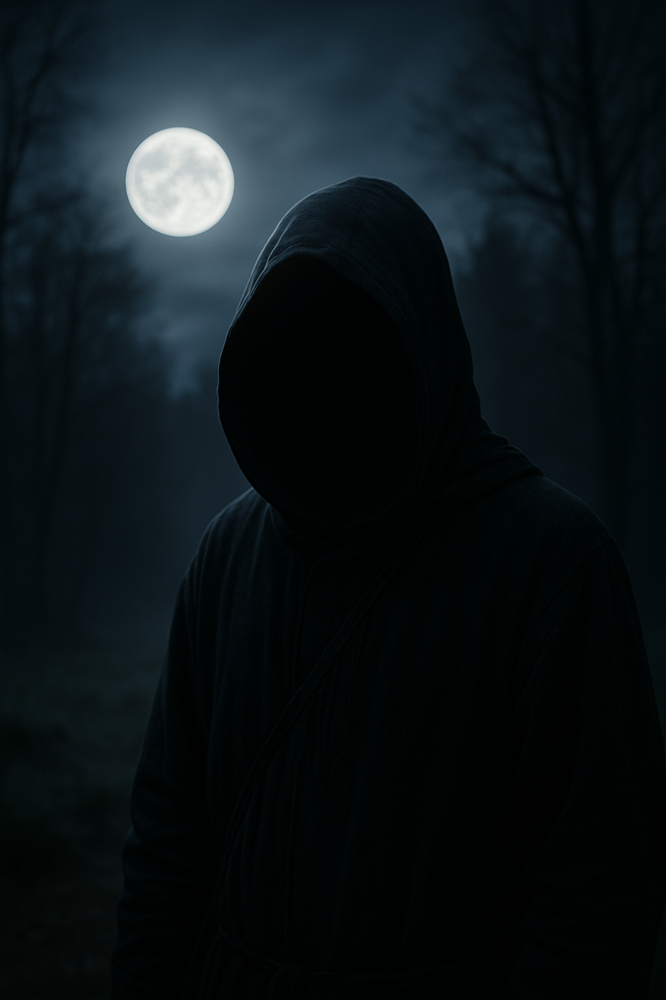

Die Glocken der Dorfkirche schweigen. Der Wind hält den Atem an. Und über dem abgelegenen Waldstück bei Oberkleinbach leuchtet der Vollmond so hell, als hätte ihn jemand mit Absicht aufgedreht. In dieser Nacht wiederholt sich, was sich nun schon zum dritten Mal binnen drei Monaten ereignet hat: Eine kleine Gruppe in dunklen Gewändern versammelt sich im Kreis uralter Steine – mit dabei: Bürgermeister **Uwe N. Tschuldigung**, seines Zeichens CSU-Mitglied, passionierter Gartenfreund und laut Gemeindeseite „Zuständiger für kulturelle Brauchtumspflege“.

Doch was genau ist kulturelle Brauchtumspflege, wenn sie bei Vollmond, mit Räucherwerk und Trommelrhythmen in einem uralten Steinkreis geschieht?

Die Antwort ist so klar wie der Nebel über dem Kleinbach: Niemand weiß es. Aber alle haben eine Theorie.

## Die Ritualnacht vom 24. April – der Vorfall mit den Hühnern

Die erste Meldung kam von einem österreichischen Ehepaar, das mit ihrem Campervan einen Kurzurlaub in „der unberührten Natur zwischen Kleinbach und dem großen Vergessen“ verbringen wollte. In der Nacht vom 24. auf den 25. April wurden sie Zeugen – oder besser: Teilnehmer – eines seltsamen Ereignisses.

„Da waren tanzende Leute um ein Feuer, sie haben gesungen, aber nicht auf Deutsch. Und dann... ist alles schwarz geworden“, berichtet Gernot F. Zeilwurm, der sich heute an wenig erinnert – außer an einen lauten Ruf: „O Bona Luna!“

Am nächsten Morgen fanden ihn und seine Frau Feuerwehrleute in einem Hühnerstall, beide bekleidet mit Wollumhängen und Gänseblümchen im Haar. Ihr Wohnmobil? Verschwunden. Stattdessen pickten zwei neue, besonders aufmerksame Hühner auf dem Campingplatz herum. Sie hören auf die Namen „Gernötchen“ und „Luna“.

## Der Steinkreis und seine Geschichte

Der sogenannte Kleinbacher Ring stammt laut einer Untersuchung der Universität Plattensen vermutlich aus dem 6. Jahrhundert vor Christus. Die offizielle Deutung: ein vorchristlicher Versammlungsort. Die inoffizielle: ein geomantischer Knotenpunkt voller „mondaktiver“ Energie.

**Dr. Nora Lität**, Kulturwissenschaftlerin und Expertin für „rituellen Bewegungsraum in ländlicher Moderne“, sieht klare Hinweise auf eine lunare Symmetrie:
„Die Anordnung der Steine entspricht exakt dem Symbol für den planetaren Rückflusszyklus von Aldebaran – und dem Grundriss eines nicht genehmigten Kreisverkehrs, den der Gemeinderat 2021 abgelehnt hat. Zufall?“

## Was sagt der Bürgermeister?

Auf Nachfrage erklärte Bürgermeister Uwe N. Tschuldigung:

„Des is a privates Gesundheitskonzept zur Stressreduktion. Wir machen nix Verbotenes. Nur rhythmisches Durchatmen im Kreis – mit Rauchunterstützung.“

Ein Blick ins Gemeindeblatt von März 2025 zeigt jedoch ein anderes Bild. In der Rubrik Verschiedenes steht:
„Am Steinkreis wird gebeten, nächtliche Lichtquellen nicht zu melden – es handelt sich um eine energetisch-therapeutische Maßnahme zur Verbesserung der interkommunalen Resonanz.“

## Was geschah Mitte Mai? (Neuster Stand)

In der Nacht vom 12. Mai beobachteten mehrere Jugendliche aus dem Nachbardorf eine „Art Lichtschleier über dem Wald“, wie es einer von ihnen, **Timo D. Lirium**, beschreibt:

> „Es war, als hätte jemand die Luft aus einer Discokugel gemacht. Und dann war da plötzlich diese Stimme, die gesagt hat: 'Nur die im Kreis verstehen den Tanz.'“

Seitdem sind drei Smartphones verschwunden. Die Polizei spricht von Wildschwein-Aktivität. Die Betroffenen sprechen von temporärem „Realitätswackeln“.

## Interview mit einem anonymen Mitläufer – „Ich tanze für die Harmonie… und die Suppe“

Über anonyme Kanäle (eine E-Mail mit dem Betreff „Mondknoten lebt“) meldete sich eine Person, die nach eigenen Angaben regelmäßig an den Vollmondtreffen teilnimmt. Wir trafen sie – ganz klassisch – an einem unbeleuchteten Zigarettenautomaten in der Nähe von Kleinbach. Sie bestand auf Anonymität und wählte den Tarnnamen „Mondwolf X“.

🕵️‍♀️ MysteryBlogger:
Was genau passiert in diesen Nächten im Steinkreis?

🌝 Mondwolf X:
„Es geht um Einklang. Um Balance. Und darum, den alten Rhythmus der Dinge wiederzuerwecken. Manche nennen es Ritual, andere nennen es Dorf-Yoga mit Nebel.“

🕵️‍♀️ MysteryBlogger:
Und der Bürgermeister?

🌝 Mondwolf X:
„Er ist unser Taktgeber. Kein Witz – er hat eine Kalimba mitgebracht. Manchmal liest er auch aus alten Gemeinderatsprotokollen vor. Sehr spirituell.“

🕵️‍♀️ MysteryBlogger:
Gab es jemals Kontakt… mit etwas anderem?

🌝 Mondwolf X:
(lange Pause)
„Einmal, im Februar, hat jemand in der Mitte des Kreises ein Ei gelegt. Es war warm. Es vibrierte. Und dann hat es sich in Dampf aufgelöst. Seitdem macht der Bürgermeister den Abschlusskreis rückwärts.“

🕵️‍♀️ MysteryBlogger:
Was möchten Sie den Leserinnen und Lesern sagen?

🌝 Mondwolf X:
„Habt keine Angst vor dem Kreis. Nur wer im Takt tanzt, versteht die Stille dazwischen. Und: immer Wechselkleidung mitbringen.“

Dieses Interview wirft mehr Fragen auf, als es beantwortet – genau so, wie wir es mögen. Ob „Mondwolf X“ tatsächlich Mitglied der Gruppe ist oder einfach ein sehr kreativer Wanderer, bleibt unklar. Sicher ist nur: In Oberkleinbach wird der Vollmond nie wieder als rein dekoratives Himmelsobjekt betrachtet.

## Fazit

Was in den Nächten von Oberkleinbach wirklich geschieht, bleibt im Nebel verborgen – zwischen Brauchtum und Beschwörung, zwischen Bewegungsgruppe und Mondmagie. Doch eines ist sicher: Wenn der Bürgermeister bei Vollmond im Steinkreis tanzt und dabei niemand offiziell zusieht – ist es dann wirklich passiert?

Was meint ihr:
Harmlose Esoterik? Alte Energien? Oder steckt doch mehr dahinter, als man bei Tageslicht sieht?

**Schreibt eure Gedanken in die Kommentare.**
Wer war schon mal in Oberkleinbach – oder kennt ähnliche Phänomene aus seiner Region?
